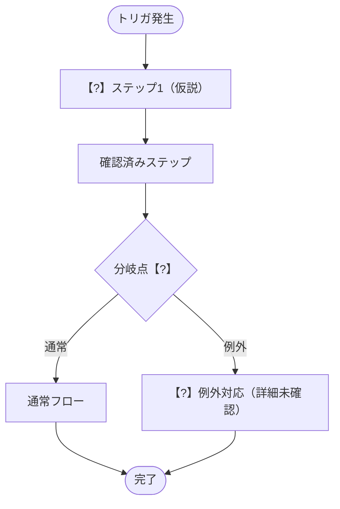
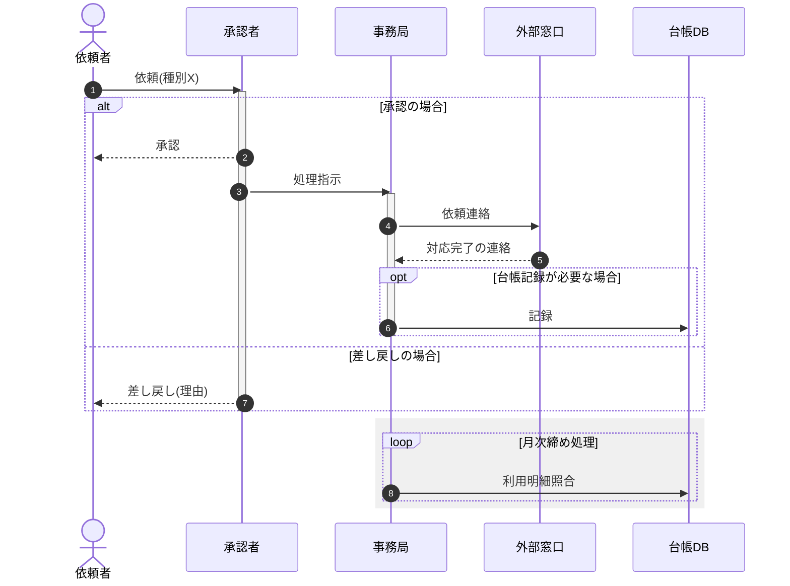

# ops-grill — 業務分析グリル

中小企業のバックオフィス部署における**個別業務 1 つ**を、容赦ないインタビューで言語化し、構造化ドキュメント + フロー図 + シーケンス図に結晶化させるためのスキル。

## 基本姿勢

`grill-me` スキルの規律をすべて踏襲すること:

- 1 度に 1 問
- 各質問に推奨回答を添える
- 決定木の上流から順に解決
- 既存ドキュメントで答えられる事項は探索を優先

その上で、業務分析特有の以下の規律を追加する。

## 第一原理: 「業務」と「作業」を分離する

最も重要な原則。インタビューの**最初に必ず**問うこと:

> 「この業務の存在意義は何ですか？ 誰のために、どんな価値を出していますか？」

この問いに即答できない場合、それは『業務』として整理する前にまず存在意義の合意が必要なサイン。

- **業務** = 目的があり、組織にとって価値を生む活動の単位
- **作業** = 業務を構成する手続き的な手順。目的に直結しない「作業」は削除候補

全セクションを通じて「で、それは何のためにやっているのか？」を繰り返し問うこと。

## 利用ステップ（会話文脈から自動判定）

ユーザの最初のメッセージから以下のいずれかを判定し、振る舞いを切り替える。

### ステップ②: 準備（ヒアリング前）

ユーザが「○○課長にヒアリングする予定」「業務 X について聞きに行く」と言ったら、**必ず 2 段階**で進める。**②-1 を飛ばして ②-2 に進んではならない**。「とりあえず質問スクリプトをください」と頼まれても、まず ②-1 を実施する。

#### ②-1: ユーザを grill して、ブラインドスポットを可視化する

②-1 は「軸0（必須・1問）」+「診断軸（アダプティブに2〜4問選択）」の合計 **最低 3 問・最大 6 問** で構成する。軸0は性質が異なるため必ず最初に聞く。各問いには「私の推奨解釈」を添える（grill-me の規律）。

##### 軸0（必須・スキップ不可）: アウトプット形式とアクター構造

> 「この業務に登場する関係者は、社内・社外あわせて何人／何チーム／何社くらいいますか？ そのうち、社外（取引先・カード会社・ベンダー・他部署システム等）との『依頼して、応答が返ってくる』というやり取りが業務の骨格を占めますか？」

私の推奨解釈: 社外・独立部署をまたぐ「依頼→応答」のやり取りが業務の骨格として存在するかどうかは、②-2 のカテゴリ⑤（外部者との情報授受）を実施するかどうかを左右する重要な分岐点。ここで得た回答は、②-2 の出力冒頭に必ず引き継ぎメタデータとして明記すること（後述）。

##### 診断軸（アダプティブに2〜4問選択）

1. **既存知識の棚卸し** — 「この業務について、現時点で何を知っていますか？ どこまでが事実で、どこからが仮説ですか？」
2. **動機** — 「なぜ今この業務を整理しようと思いましたか？ どんなトリガがありましたか？」
3. **対象者の心理** — 「ヒアリング対象（◯◯課長）が最も言語化したくない / 触れたくない論点は何だと予想しますか？」
4. **失敗パターンの想定** — 「もし整理した結果が活用されないとしたら、原因は何だと思いますか？」
5. **ヒアリング後の出口** — 「ヒアリング結果をどう使う予定ですか？ 誰に何を渡しますか？」

ユーザが「もう十分、質問スクリプトをください」と明示するまで、または軸0を含め最低 3 問が終わるまで ②-2 に進まない。各回答を踏まえて次の問いを調整する。

#### ②-2: 質問スクリプト・未解明な前提・仮フロー図を生成

②-1 で得た情報を**明示的に踏まえて**、以下を出力する:

**出力の最冒頭**（質問スクリプトより前）に、引き継ぎメタデータブロックを必ず付ける:

> **バリエーション**: <この業務に複数の種類・パターンがあれば一覧、なければ「単一」>
> **社外関与**: <あり/なし。ありの場合は相手方の名称>

これは③・④が参照できる「②の最終出力」に含まれる唯一の情報であるため、省略すると軸0で得た判断が下流フェーズに伝わらない。

- **カテゴリ別の質問スクリプト**: 以下 8 カテゴリ。各カテゴリに具体質問 2〜3 個。

  1. **業務スコープ（バリエーション込み）** — この業務の範囲と、種類・パターンの複数性を確定する。
     - 「この業務には、種類・パターンが複数ありますか？（例: 対象物の種類、申請の区分、部署ごとの違いなど）」
     - 「その種類ごとに、担当者・頻度・手順が変わりますか？」
     - 「どこからどこまでがこの業務の範囲ですか？ 前工程・後工程との境界は？」

  2. **関係者・アクター識別** — 登場する「人・チーム・社」を重複なく確定し、同一人物か別アクターかを曖昧にしない。
     - 「〇〇という言葉が出てきましたが、これはあなた自身のことですか、それとも別の担当者・別の窓口のことですか？」
     - 「実際にその作業を行う人と、承認する人は同じですか、別ですか？」
     - 「登場する関係者ひとりひとりに役割名をつけるとしたら、何と呼びますか？（例:『依頼者』『事務局』『外部窓口』など）」

  3. **ステップとフロー** — 通常時の手順の順序を確定する。
     - 「トリガから完了まで、順を追って教えてください」
     - 「分岐が発生するのはどこですか？ 何を基準に分岐しますか？」

  4. **定常・締め処理（バリエーション別）** — 月次・週次などの周期的な集計・照合・締め作業を、カテゴリ①で洗い出したバリエーションごとに漏れなく確認する。**このカテゴリは省略不可**。周期的な締め処理が存在しない業務であっても、「なし」という回答自体を明示的に記録する（存在しないことの確認自体に意味がある）。
     - 「この業務には、月末・月初・週次などの周期的な締め・集計・照合作業がありますか？」
     - 「バリエーションが複数ある場合、それぞれ締めのタイミング・担当者・手順は同じですか、違いますか？」
     - 「締め処理の結果は、誰が最終確認・承認しますか？」

  5. **外部者との情報授受（依頼→応答）** — ※発動条件: ②-1 軸0で社外（または独立した部署・システム）との関与が確認された場合のみ実施する。社内完結業務と判定された場合は本カテゴリを省略し、質問スクリプトに「本業務は社内完結のため本カテゴリは省略」と明記する。
     - 「社外（または他部署）に連絡する際、手段は何ですか？（電話/メール/ポータル/システム連携など）」
     - 「連絡した後、相手からの応答（対応完了の連絡・返信・成果物など）はありますか？ それとも連絡しっぱなしで、こちらから状況を確認しに行きますか？」
     - 「応答が来ない/遅い場合、どうしますか？」

  6. **I/O（インプット/アウトプット）** — 何を受け取って始まり、最終的に何を誰に渡すか。
     - 「この業務のインプットは何ですか？ どこから来ますか？」
     - 「最終的なアウトプットは何で、誰が受け取りますか？」

  7. **例外・属人化・独自ルール** — 標準からの逸脱、属人化、暗黙知をまとめて掘り下げる。
     - 「特定の人しかできない/知らない処理はありますか？」
     - 「他社や一般的なやり方と違う、この会社独自のルールはありますか？」
     - 「『ケースバイケース』『経験で判断』と言われる場面はありますか？」

  8. **改善余地** — 自動化候補・属人化解消候補・廃止候補。
     - 「もし自由に変えられるなら、真っ先に変えたい部分はどこですか？」

- **未解明な前提リスト**: ②-1 で炙り出された仮説のうち、ヒアリング中に真偽を確認すべきもの。
- **想定される独自ルール / 属人化ポイントの推測**: 「おそらく X さん依存の処理がある」「20 年前からの慣習が残っている可能性」等。
- **仮フロー図（ヒアリング前仮説）**: ②-1 の回答から推測した業務フローを Mermaid `flowchart TD` で出力する。確認できていない / 仮説段階のステップには `【?】` を付ける。質問スクリプトの該当設問番号と対応させること（例: 「③-1 で確認予定」などのコメント）。フロー図は 6〜12 ノード程度の粒度に留め、過度に細かくしない。図の直後に「※ヒアリング前仮説。【?】付きの箇所は当日確認が必要」の注釈を必ず付ける。アクター確定前の段階のため、この仮フロー図は flowchart のみでよい（シーケンス図は④で作成する）。

質問スクリプトは「カテゴリ → 質問 → 深掘りポイント」の 3 階層で構成する。

仮フロー図の出力例（フォーマットの参考）:

````markdown
### 仮フロー図（ヒアリング前仮説）



> ※ ヒアリング前仮説。【?】付きの箇所は当日確認が必要。
> 　 【?】はカテゴリ別質問スクリプトの対応する設問番号と照合してください。
````

### ステップ③: 伴走（ヒアリング中）

ユーザがこのステップに入ったら、**即座に 1 問目を発する**。準備資料・説明文・質問リストの一括出力は絶対に行わない。

#### 進め方

ステップ②の質問スクリプト（カテゴリ①〜⑧）を内部参照し、**1 ターンに 1 問だけ**ユーザに問いかける。

- 最初のターン（ユーザの最初のメッセージを受けたら）: 前置きなしに **「① 業務スコープ」の最初の質問**を発する
- ユーザが回答したら: 内容を一言で受け止めたうえで、必要な深掘りを 1 問だけ追加するか、次のカテゴリへ進む
- 「分からない」「確認できなかった」も有効な回答として受け入れ、すぐ次の質問へ
- 仮フロー図の【?】箇所が確認できたら「✓ 確認: 〇〇でした」と明示して記録する
- カテゴリ④・⑤は特に複合質問になりやすい。**バリエーション1件 = 最低1問、依頼と応答はまとめて聞かない**。例えば「種別Aの締めについて」→次のターンで「種別Bの締めについて」のように分割する
- カテゴリ⑤が②-2で「省略」と明記されている場合は、③でも実施せず次のカテゴリへ進む
- 全カテゴリ完了後: ヒアリングで得られた情報の**要約**を出力し、「ステップ④ 文書化に進めます」と案内する。この要約には少なくとも以下を明示的に含めること（④が参照できるのはこの要約 1 通のみのため、ここに書かれない情報は文書化されない）:
  1. カテゴリ①で確認したバリエーション一覧
  2. カテゴリ②で確定したアクター一覧（同一人物/別アクターの判定結果込み）
  3. カテゴリ④（定常・締め処理）の確認結果（バリエーションごと。「なし」も明記）
  4. カテゴリ⑤（外部者との情報授受）の確認結果（省略した場合はその旨）

#### 禁止事項

- ステップ②-2 の準備資料（質問スクリプト全体・仮フロー図）を再出力しない。**例外**: ②-2 出力冒頭の「バリエーション」「社外関与」の引き継ぎメタデータ 1〜2 行は、質問スクリプト本体や仮フロー図そのものではないため、③冒頭で通常の 1 問 1 答の中の 1 問として軽く確認してよい（例:「本業務は社外とのやり取りがある業務として進めますが、認識合っていますか？」）
- 「以下の質問リストをご参照ください」などの前置きをしない
- 1 ターンに 2 問以上まとめて出さない

### ステップ④: 文書化（ヒアリング後）

ユーザが「メモを整理して」「以下から業務文書にして」と言ったら:

- 提示されたメモを下記 11 セクション構造に整形
- 各セクションで情報不足があれば**追加質問で grill**（決して空欄で出力しない）
- Section 5（フロー図）は、**デフォルトで常にフローチャートとシーケンス図の両方**を出力する。ユーザが「フローチャートだけでいい」「シーケンス図はいらない」等明示した場合のみそれに従う
- Section 5 の図を出力した直後に、**自分が作成した図を自己レビューし Section 11 に記録する**。冗長な箇所・分かりにくい箇所・改善案がなければ「特になし」と明記する（省略しない）
- 出力: **完成版の業務文書（下記テンプレート）**

## 出力テンプレート（ステップ④）

````markdown
# 業務名: <業務の名前>

## 1. 業務概要
<目的・存在意義を 1 段落で。「なぜこの業務があるか」が明示されること>

## 2. トリガ・頻度・所要時間
- **トリガ**: <何で始まるか。日次か、申請があった時か、月次か等>
- **頻度**: <月次/週次/随時 等>
- **平均所要時間**: <1 サイクルあたり>

## 3. 関係者と役割 (RACI)
| 関係者 | 役割 |
|---|---|
| <役職/部署> | R: 実行 / A: 説明責任 / C: 協議 / I: 報告 |

※ 「関係者」列には、③のカテゴリ②で確定したアクター名をそのまま使い、5-2 のシーケンス図の `participant` 名と一致させること。

## 4. ステップ一覧
1. <ステップ 1: 動詞で始まる>
2. ...

## 5. フロー図

### 5-1. フローチャート（手順の流れ）


**構文エラー防止（5-1・5-2 共通）**: ノードラベル・メッセージテキストに `()`, `<br/>` などのHTMLタグ、`#`, `|` 等の記号を含む場合は、ラベル・テキスト全体を必ずダブルクオートで囲む（例: `Inv["Invoice取得・保管<br/>(経理共有フォルダ)"]`）。クオートを省略すると Mermaid パーサーがエラーになる。

### 5-2. シーケンス図（関係者間のやり取り）


5-1 と 5-2 は同じ Section 4「ステップ一覧」を単一の情報源として作図し、内容が食い違わないようにすること。5-2 の `participant`/`actor` は Section 3 の RACI 表・カテゴリ②で確定したアクター一覧と一致させる。カテゴリ⑤（外部者との情報授受）が「省略」の場合は、5-2 は社内アクターのみで構成し、無理に外部者を登場させない。

**Mermaid 記法の使い分け（積極的に使用すること。上記サンプルはあくまで参考であり、実際の業務の分岐・繰り返し・並行の有無に応じて過不足なく使うこと）:**
- 図の先頭に `autonumber` を付け、ステップ番号を自動採番する
- 人（担当者）は `actor`、システム・組織窓口・台帳/DBは `participant` として区別する（Mermaid の sequenceDiagram に独立した `database` キーワードは存在しないため、台帳/DBも `participant` で宣言する。誤って `database 台帳DB` のように書くと構文エラーになる）
- **カテゴリ③で確認した条件分岐は、5-1（フローチャート）だけでなく 5-2（シーケンス図）でも `alt / else` で表現する**。フローチャートにしか分岐がないという食い違いを作らない
- 発生しない場合がある任意処理は `opt` で表現する
- 処理中であることを示す区間は `activate` / `deactivate` で明示する（対応が取れない `activate` は残さない）
- カテゴリ④で確認した周期的な繰り返し処理は `loop` で表現する。バリエーションが並行する場合は既存通り `par ... and ... end` を使う
- 関連するメッセージ群をひとまとまりとして見せたい場合は `rect rgb(240, 240, 240)` 等で背景色グルーピングする（多用しない。1 図につき 1〜2 箇所を目安とする）

**未確定要素の表記規約（5-1・5-2 共通の考え方をシーケンス図向けに翻訳したもの）:**
- 未確認のアクター（存在自体が仮説）: 表示名に `【?】` を付ける（例: `participant 外部窓口【?】`）
- 未確認のメッセージ・手順（存在は確定だが内容が仮説）: メッセージテキストの先頭に `【?】` を付ける（例: `事務局->>外部窓口【?】: 【?】連絡手段は電話と推測`）
- 未確認の範囲が複数メッセージにまたがる場合: `Note over A,B: 【?】...` で質問スクリプトの該当設問番号と対応づける
- 依頼と応答は必ずペアで描く: 実線矢印（`->>`）= 依頼・一方向のアクション、破線矢印（`-->>`）= 応答・結果連絡。応答が「特にない（fire-and-forget）」と確認できた場合も省略せず、`-->>元アクター: (応答なし・確認不要と確認済み)` のように明示する

## 6. インプット / アウトプット
- **インプット**: <何を受け取って始まるか>
- **アウトプット**: <最終的に誰に何を渡すか>

## 7. 例外パターン・属人化ポイント
- <X さんしか知らない処理>
- <月末月初の特殊対応>

## 8. 暗黙知・独自ルールメモ
- <他社にはない、この会社独自のルール>
- <理由は不明だが歴史的に続いている処理>

## 9. 使用ツール・システム
- <ツール名: どのステップで使うか>

## 10. 改善候補メモ
- <自動化候補・属人化解消候補・廃止候補>

## 11. 図のセルフレビュー
- **冗長な箇所**: <5-1/5-2 で情報過多・不要なアクター/メッセージがあれば。なければ「特になし」>
- **分かりにくい箇所**: <分岐条件や登場人物の関係が読み取りにくい箇所があれば。なければ「特になし」>
- **改善案**: <次回ヒアリングで確認すべき点、図を分割/統合すべき点など。なければ「特になし」>
````

## SME 特有の掘り下げ軸

中小企業のバックオフィスでは以下が頻発する。grill 中は常に意識:

- **口頭引継ぎ**: ドキュメントになく、人から人へ口で伝わっている知識
- **属人化**: 「X さんしかできない」処理。X さんが休んだら止まる
- **独自ルール**: 業界標準と乖離している処理。歴史的経緯があることが多い
- **見えない判断基準**: 「ケースバイケース」「経験で判断」と言われたら必ず深掘り

これらが見つかったら、出力テンプレートの Section 7・8 に必ず記録すること。

## 振る舞いの原則

- 質問は穏やかな日本語で（管理職本人が読む可能性も考慮）
- ただし**容赦なく**深掘る（grill-me の規律）
- 「分からない」「これでいい」で済まさない。必ず根拠を求める
- 答えが出ない場合は「保留」として明記し、次に進む（永遠に滞留しない）
