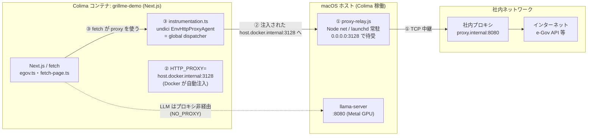
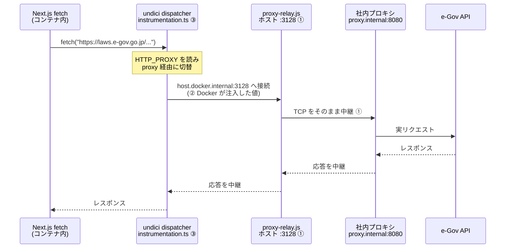

# 社内プロキシ対応の構造解説

社内プロキシ環境（Issue #29）で「法令・実務リサーチ」がコンテナから外部 API に
繋がらなかった問題を、どんな部品でどう解決しているかを図解する**解説ドキュメント**。

> 実際のセットアップ手順（コード・設定の現物）は
> [`corporate-proxy-setup.md`](./corporate-proxy-setup.md) を参照。
> 本書はその「なぜこの構造なのか」を理解するための補足。

## 全体像：なぜ2つの対策が必要だったか

コンテナが外部（e-Gov API 等）に繋がらない原因は、**性質の違う2つの問題が
重なっていた**こと。それぞれ別の層で解く必要があった。

| #   | 問題                                                                                                              | 層             |
| --- | --------------------------------------------------------------------------------------------------------------- | -------------- |
| 問題A | **Colima の VM ネットワークから社内プロキシへ TCP が通らない**。Mac ホストからは届くが、コンテナが乗る別ネットワークからは届かない | ネットワーク層 |
| 問題B | **Node.js 標準の `fetch`（undici）は `HTTP_PROXY` を自動で読まない**。Python / Go は自動で読むが Node だけ明示設定が要る  | アプリ層       |

これを **3つの部品** で解いている。

## 使っている部品（3層構成）

| 層            | 部品                                  | 使っている技術                                                | 役割                                                                                                                       |
| ------------- | ------------------------------------- | ------------------------------------------------------------- | -------------------------------------------------------------------------------------------------------------------------- |
| ① TCP リレー  | `~/docker-proxy-relay/proxy-relay.js` | Node.js の `net` モジュール（生 TCP 中継）＋ **launchd** で常駐 | ホスト上で `0.0.0.0:3128` を待ち受け、コンテナからの接続を社内プロキシ `proxy.internal:8080` へそのまま中継。**問題Aを解決** |
| ② Docker 自動注入 | `~/.docker/config.json` の `proxies` | Docker CLI のプロキシ設定機能                                  | 起動する**全コンテナ**に `HTTP_PROXY=http://host.docker.internal:3128` を自動注入。コンテナ個別の設定が不要に                |
| ③ Node.js 対応 | `instrumentation.ts` ＋ `undici`      | Next.js の instrumentation hook ＋ undici の `EnvHttpProxyAgent` | サーバ起動時に1回、undici のグローバル dispatcher をプロキシ対応版に差し替え。`fetch` が `HTTP_PROXY` を見るように。**問題Bを解決** |

ポイントは **「コンテナ → `host.docker.internal:3128`（ホスト上のリレー）→ 社内プロキシ
→ インターネット」** という経路を作っていること。コンテナは社内プロキシを直接知らず、
いつもホスト上のリレーに話しかけるだけで済む。

## 構成図

## リクエストの流れ

## 補足（理解の助けに）

- **なぜ LLM だけプロキシを通さないか**: `~/.docker/config.json` の `noProxy` に
  `host.docker.internal` を入れているため、ホスト上の llama-server（`:8080`）への
  通信はプロキシを経由せず直接届く。外部 API だけプロキシ、内部 LLM は直結、と
  使い分けている。
- **リポジトリに入っているのは③だけ**: `instrumentation.ts` / `undici` 依存 /
  Dockerfile の undici コピーはコード側なのでリポジトリ管理。①②（リレー本体・
  launchd・docker config）は**そのホスト固有のインフラ設定**なので、コードでは
  なく [`corporate-proxy-setup.md`](./corporate-proxy-setup.md) に手順として残す方針。
- **Dockerfile で undici を明示コピーしている理由**: `instrumentation.ts` が
  `await import('undici')` と**動的 import** するため、Next の standalone ビルドの
  依存トレースに undici が含まれず、手動コピーで補っている。

この3層がそろって初めて「コンテナ内の `fetch` が社内プロキシ越しに e-Gov へ届く」
状態になる。
